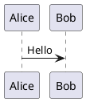

# 扩展 (Extensions)

所有扩展位于 `src/extensions/`，通过 `index.ts` 统一导出。

## 目录

- [Underline](#underline)
- [Link](#link)
- [Image](#image)
- [VideoBlock](#videoblock)
- [Table](#table)
- [TaskList / TaskItem](#tasklist--taskitem)
- [CodeBlockLowlight](#codeblocklowlight)
- [MathInline](#mathinline)
- [MathBlock](#mathblock)
- [PlantUMLBlock](#plantumlblock)
- [SlashCommand](#slashcommand)
- [CustomKeymap](#customkeymap)

---

## Underline

**文件**: `underline.ts`

**类型**: Mark

**功能**: 下划线文本修饰

**来源**: 直接导出 `@tiptap/extension-underline`

**快捷键**: `Ctrl+U` (通过 CustomKeymap)

**用法**:
```ts
editor.chain().focus().toggleUnderline().run()
```

---

## Link

**文件**: `link.ts`

**类型**: Mark

**功能**: 超链接

**来源**: 配置 `@tiptap/extension-link`

**配置**:
| 选项 | 值 | 说明 |
|------|------|------|
| openOnClick | false | 编辑模式下点击不跳转 |
| autolink | true | 自动识别 URL |
| linkOnPaste | true | 粘贴 URL 自动转为链接 |

**用法**:
```ts
editor.chain().focus().setLink({ href: 'https://...' }).run()
editor.chain().focus().unsetLink().run()
```

---

## Image

**文件**: `image.ts`

**类型**: Node

**功能**: 可调整大小的图片

**属性**:
| 属性 | 类型 | 默认值 | 说明 |
|------|------|--------|------|
| src | string | null | 图片 URL |
| alt | string | null | 替代文本 |
| title | string | null | 标题 |
| width | number | 100 | 宽度百分比 (10-100) |

**NodeView**: 自定义 DOM 结构
```html
<div class="resizable-image" style="width: {width}%">
  <div class="resize-handle resize-handle-left"></div>
  
  <div class="resize-handle resize-handle-right"></div>
</div>
```

**Markdown 序列化**: 原始 HTML 格式
```html

```

**用法**:
```ts
editor.chain().focus().setImage({ src: '...' }).run()
```

---

## VideoBlock

**文件**: `video-block.ts`

**类型**: Node

**功能**: 可调整大小的视频播放器

**属性**:
| 属性 | 类型 | 默认值 | 说明 |
|------|------|--------|------|
| src | string | "" | 视频 URL |
| width | number | 100 | 宽度百分比 |
| title | string | "" | 标题 |

**NodeView**: 自定义 DOM 结构
```html
<div class="resizable-video" style="width: {width}%">
  <div class="resize-handle resize-handle-left"></div>
  <video class="video-block-player" controls src="..."></video>
  <div class="resize-handle resize-handle-right"></div>
</div>
```

**Markdown 序列化**: 原始 HTML 格式
```html
<video src="..." width="50%" title="..."></video>
```

**用法**:
```ts
editor.commands.insertContent({
  type: 'videoBlock',
  attrs: { src: '...' }
})
```

---

## Table

**文件**: `table.ts`

**类型**: Node (Table, TableRow, TableHeader, TableCell)

**功能**: 表格编辑

**来源**: 配置 `@tiptap/extension-table` 系列

**配置**:
| 选项 | 值 | 说明 |
|------|------|------|
| resizable | false | 禁用列宽调整 |

**导出**:
- `Table` - 表格容器
- `TableRow` - 行
- `TableHeader` - 表头单元格
- `TableCell` - 普通单元格

**用法**:
```ts
editor.chain().focus().insertTable({ rows: 3, cols: 3, withHeaderRow: true }).run()
editor.chain().focus().addColumnAfter().run()
editor.chain().focus().addRowBefore().run()
editor.chain().focus().deleteRow().run()
editor.chain().focus().deleteColumn().run()
editor.chain().focus().deleteTable().run()
```

---

## TaskList / TaskItem

**文件**: `task-list.ts`

**类型**: Node

**功能**: 带复选框的任务列表

**来源**: 配置 `@tiptap/extension-task-list` 和 `@tiptap/extension-task-item`

**配置**:
- TaskItem: `nested: true` - 支持嵌套

**用法**:
```ts
editor.chain().focus().toggleTaskList().run()
```

---

## CodeBlockLowlight

**文件**: `code-block.ts`

**类型**: Node

**功能**: 语法高亮代码块

**来源**: 配置 `@tiptap/extension-code-block-lowlight`

**依赖**: lowlight (使用 `common` 语言包)

**common 语言包含**:
- JavaScript, TypeScript, Python, Java, C/C++
- Go, Rust, Ruby, PHP, Swift, Kotlin
- HTML, CSS, JSON, YAML, Markdown
- Bash, SQL, XML 等

**用法**:
```ts
editor.chain().focus().toggleCodeBlock().run()
```

---

## MathInline

**文件**: `math-inline.ts`

**类型**: Node (inline)

**功能**: 行内数学公式

**Markdown 语法**: `$LaTeX$`

**属性**:
| 属性 | 类型 | 说明 |
|------|------|------|
| latex | string | LaTeX 源码 |

**NodeView**:
- KaTeX 渲染显示
- 点击弹出 prompt 编辑

**InputRule**: 输入 `$...$` 自动转换

**Markdown 序列化**:
```
$E = mc^2$
```

---

## MathBlock

**文件**: `math-block.ts`

**类型**: Node (block)

**功能**: 块级数学公式

**Markdown 语法**:
```
$$
LaTeX
$$
```

**属性**:
| 属性 | 类型 | 说明 |
|------|------|------|
| latex | string | LaTeX 源码 |

**NodeView**:
- 上方 textarea 输入框
- 下方实时 KaTeX 预览
- Escape 键退出编辑

**InputRule**: 输入 `$$` 自动创建

---

## PlantUMLBlock

**文件**: `plantuml-block.ts`

**类型**: Node

**功能**: PlantUML 图表

**属性**:
| 属性 | 类型 | 默认值 | 说明 |
|------|------|--------|------|
| source | string | `@startuml\n\n@enduml` | PlantUML 源码 |

**渲染**:
- 使用 plantuml-encoder 编码
- 请求 `https://www.plantuml.com/plantuml/svg/{encoded}`

**防抖**: 500ms

**NodeView**:
- 上方 textarea 输入框
- 下方 SVG 预览图
- Escape 键退出编辑

**InputRule**: 输入 ` ```plantuml ` 自动创建

**Markdown 序列化**:
```


---

## SlashCommand

**文件**: `slash-command.tsx`

**类型**: Extension

**功能**: 斜杠命令菜单

**触发**: 输入 `/`

**命令分组**:

| 组 | 命令 |
|------|------|
| text | Heading 1, Heading 2, Heading 3 |
| list | Bullet List, Numbered List, Task List |
| block | Blockquote, Code Block, Horizontal Rule |
| media | Table, Image, Video |
| advanced | Math Block, PlantUML |

**图标**: Phosphor Icons (20px)

**导出类型**:
```ts
export type SlashCommandGroup = "text" | "list" | "block" | "media" | "advanced";

export interface SlashCommandItem {
  title: string;
  description: string;
  icon: ReactNode;
  group: SlashCommandGroup;
  command: (props: { editor: Editor; range: Range }) => void;
}
```

---

## CustomKeymap

**文件**: `custom-keymap.ts`

**类型**: Extension

**功能**: 自定义快捷键

**快捷键**:
| 快捷键 | 动作 |
|--------|------|
| Mod-Alt-1 | Heading 1 |
| Mod-Alt-2 | Heading 2 |
| Mod-Alt-3 | Heading 3 |
| Mod-Alt-0 | 普通段落 |
| Mod-u | 下划线 |

注: `Mod` = Ctrl (Windows/Linux) 或 Cmd (Mac)
