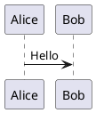

# Extensions

All extensions are in `src/extensions/` and exported via `index.ts`.

## Contents

- [Underline](#underline)
- [Link](#link)
- [Image](#image)
- [VideoBlock](#videoblock)
- [Table](#table)
- [TaskList / TaskItem](#tasklist--taskitem)
- [CodeBlockLowlight](#codeblocklowlight)
- [MathInline](#mathinline)
- [MathBlock](#mathblock)
- [PlantUMLBlock](#plantumlblock)
- [SlashCommand](#slashcommand)
- [CustomKeymap](#customkeymap)
- [Highlight](#highlight)
- [TyporaMode](#typoramode)

---

## Underline

**File**: `underline.ts`

**Type**: Mark

**Source**: Re-exports `@tiptap/extension-underline`

**Shortcut**: `Ctrl+U` (via CustomKeymap)

**Usage**:
```ts
editor.chain().focus().toggleUnderline().run()
```

---

## Link

**File**: `link.ts`

**Type**: Mark

**Source**: Configured `@tiptap/extension-link`

**Configuration**:
| Option | Value | Description |
|--------|-------|-------------|
| openOnClick | false | Don't navigate on click in edit mode |
| autolink | true | Auto-detect URLs |
| linkOnPaste | true | Convert pasted URLs to links |

**Usage**:
```ts
editor.chain().focus().setLink({ href: 'https://...' }).run()
editor.chain().focus().unsetLink().run()
```

---

## Image

**File**: `image.ts`

**Type**: Node

**Attributes**:
| Attribute | Type | Default | Description |
|-----------|------|---------|-------------|
| src | string | null | Image URL |
| alt | string | null | Alt text |
| title | string | null | Title |
| width | number | 100 | Width percentage (10-100) |

**NodeView**: Custom DOM structure
```html
<div class="resizable-image" style="width: {width}%">
  <div class="resize-handle resize-handle-left"></div>
  
  <div class="resize-handle resize-handle-right"></div>
</div>
```

**Drag-and-Drop**: Dropping image files inserts `` placeholder at drop position

**Markdown Serialization**: Raw HTML
```html

```

**Usage**:
```ts
editor.chain().focus().setImage({ src: '...' }).run()
```

---

## VideoBlock

**File**: `video-block.ts`

**Type**: Node

**Attributes**:
| Attribute | Type | Default | Description |
|-----------|------|---------|-------------|
| src | string | "" | Video URL |
| width | number | 100 | Width percentage |
| title | string | "" | Title |

**NodeView**: Custom DOM structure
```html
<div class="resizable-video" style="width: {width}%">
  <div class="resize-handle resize-handle-left"></div>
  <video class="video-block-player" controls src="..."></video>
  <div class="resize-handle resize-handle-right"></div>
</div>
```

**Markdown Serialization**: Raw HTML
```html
<video src="..." width="50%" title="..."></video>
```

**Usage**:
```ts
editor.commands.insertContent({
  type: 'videoBlock',
  attrs: { src: '...' }
})
```

---

## Table

**File**: `table.ts`

**Type**: Node (Table, TableRow, TableHeader, TableCell)

**Source**: Configured `@tiptap/extension-table` family

**Configuration**:
| Option | Value | Description |
|--------|-------|-------------|
| resizable | false | Column resize disabled |

**Exports**:
- `Table` - Table container
- `TableRow` - Row
- `TableHeader` - Header cell
- `TableCell` - Body cell

**Usage**:
```ts
editor.chain().focus().insertTable({ rows: 3, cols: 3, withHeaderRow: true }).run()
editor.chain().focus().addColumnAfter().run()
editor.chain().focus().addRowBefore().run()
editor.chain().focus().deleteRow().run()
editor.chain().focus().deleteColumn().run()
editor.chain().focus().deleteTable().run()
```

---

## TaskList / TaskItem

**File**: `task-list.ts`

**Type**: Node

**Source**: Configured `@tiptap/extension-task-list` and `@tiptap/extension-task-item`

**Configuration**:
- TaskItem: `nested: true` - supports nesting

**Usage**:
```ts
editor.chain().focus().toggleTaskList().run()
```

---

## CodeBlockLowlight

**File**: `code-block.ts`

**Type**: Node

**Source**: Configured `@tiptap/extension-code-block-lowlight`

**Dependency**: lowlight with `common` language pack

**Supported languages** (common pack):
- JavaScript, TypeScript, Python, Java, C/C++
- Go, Rust, Ruby, PHP, Swift, Kotlin
- HTML, CSS, JSON, YAML, Markdown
- Bash, SQL, XML, etc.

**Usage**:
```ts
editor.chain().focus().toggleCodeBlock().run()
```

---

## MathInline

**File**: `math-inline.ts`

**Type**: Node (inline)

**Markdown Syntax**: `$LaTeX$`

**Attributes**:
| Attribute | Type | Description |
|-----------|------|-------------|
| latex | string | LaTeX source |

**NodeView**:
- KaTeX rendered display
- Click to edit via prompt

**InputRule**: Typing `$...$` auto-converts

**PasteRule**: Pasting text containing `$...$` auto-converts to math nodes

**Markdown Serialization**:
```
$E = mc^2$
```

---

## MathBlock

**File**: `math-block.ts`

**Type**: Node (block)

**Markdown Syntax**:
```
$$
LaTeX
$$
```

**Attributes**:
| Attribute | Type | Description |
|-----------|------|-------------|
| latex | string | LaTeX source |

**NodeView**:
- Textarea input above
- Live KaTeX preview below
- Escape key exits editing

**InputRule**: Typing `$$` auto-creates

---

## PlantUMLBlock

**File**: `plantuml-block.ts`

**Type**: Node

**Attributes**:
| Attribute | Type | Default | Description |
|-----------|------|---------|-------------|
| source | string | `@startuml\n\n@enduml` | PlantUML source |

**Rendering**:
- Uses plantuml-encoder to encode
- Fetches `https://www.plantuml.com/plantuml/svg/{encoded}`

**Debounce**: 500ms

**NodeView**:
- Textarea input above
- SVG preview below
- Escape key exits editing

**InputRule**: Typing ` ```plantuml ` auto-creates

**Markdown Serialization**:
```


---

## SlashCommand

**File**: `slash-command.tsx`

**Type**: Extension

**Trigger**: Type `/`

**Command Groups**:

| Group | Commands |
|-------|----------|
| text | Heading 1, Heading 2, Heading 3 |
| list | Bullet List, Numbered List, Task List |
| block | Blockquote, Code Block, Horizontal Rule |
| media | Table, Image, Video |
| advanced | Math Block, PlantUML |

**Icons**: Phosphor Icons (20px)

**Exported Types**:
```ts
export type SlashCommandGroup = "text" | "list" | "block" | "media" | "advanced";

export interface SlashCommandItem {
  title: string;
  description: string;
  icon: ReactNode;
  group: SlashCommandGroup;
  command: (props: { editor: Editor; range: Range }) => void;
}
```

---

## CustomKeymap

**File**: `custom-keymap.ts`

**Type**: Extension

**Shortcuts**:
| Shortcut | Action |
|----------|--------|
| Mod-Alt-1 | Heading 1 |
| Mod-Alt-2 | Heading 2 |
| Mod-Alt-3 | Heading 3 |
| Mod-Alt-4 | Heading 4 |
| Mod-Alt-5 | Heading 5 |
| Mod-Alt-6 | Heading 6 |
| Mod-Alt-0 | Paragraph |
| Mod-u | Underline |
| Mod-Shift-h | Highlight |
| Mod-k | Insert Markdown link `[]()` |

Note: `Mod` = Ctrl (Windows/Linux) or Cmd (Mac)

---

## Highlight

**File**: `highlight.ts`

**Type**: Mark

**Source**: Extended `@tiptap/extension-highlight`

**Markdown Syntax**: `==highlighted text==`

**Shortcut**: `Ctrl+Shift+H` (via CustomKeymap)

**Storage**: Defines `markdown.serialize` and `markdown.parse` for `==...==` syntax

**Usage**:
```ts
editor.chain().focus().toggleHighlight().run()
```

---

## TyporaMode

**File**: `typora-mode.ts`

**Type**: Extension

**Purpose**: Typora-style live heading markers

**Behavior**:
- Shows Markdown heading markers (`#`, `##`, etc.) when cursor is inside a heading
- Hides markers when cursor moves elsewhere
- Uses ProseMirror `Decoration.widget` for markers
- Decorations callback wrapped in try-catch, returns `DecorationSet.empty` on error

**Supported Markers**:
| Level | Marker |
|-------|--------|
| 1 | `# ` |
| 2 | `## ` |
| 3 | `### ` |
| 4 | `#### ` |
| 5 | `##### ` |
| 6 | `###### ` |

**CSS Classes**:
- `.live-md-heading-marker` - Heading marker styling
